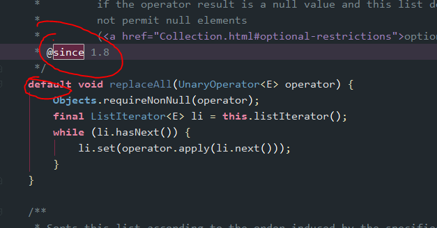
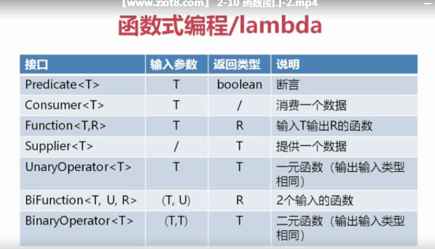

### jdk1.8新特性：WebFlux响应式编程

### 第一章、函数式编程与Lambda表达式

#### 一、为什么使用函数式编程

1. 函数式编程可以使用多线程( parallel() 方法)，并行环境，效率更高

```java
// parallerl方法表示使用多线程，效率更高
int [] arr = {100,200,500,-100,99,66,0};
int min = InStream.of(num).parallel().min().getAsInt();
```

2. IntStream、LongStream、DoubleStream的使用

   ```java
   // 拿IntStream举例
   int asInt = IntStream.of(arr).min().getAsInt();// 求arr数组中的最小值
   int sum = IntStream.of(arr).sum(); // 求arr数组中所有元素的和
   // 把doubleArray中重复的数据去重，再调用toArray方法遍历
   DoubleStream doubleArray = DoubleStream.of(doubleArray).parallel().distinct();
   for (double v : skip.toArray()) {
     System.out.println(v);
   }
   // 把doubleArray中数据由小到大排序，再调用toArray方法遍历
   DoubleStream skip = DoubleStream.of(doubleArray).parallel().sorted();
   for (double v : skip.toArray()) {
     System.out.println(v);
   }
   ```

3. lambda表达式写法更简便

   ~~~java
   // JDK8 之前的写法
   new Thread(new Runnable() {
            @Override
            public void run() {
                System.out.println("在新线程里运行的代码");
            }
        }).start();
    // JDK8 lambda表达式写法
    new Thread(()-> System.out.println("在JDK8 lambda表达式中开启新线程")).start();
   ~~~

   ### 二、lambda表达式初接触###

   lambda表达式就是返回了***指定接口的对象实例，且此接口只能有一个要实现的方法***

   ~~~java
   // 表示此接口是一个函数接口 只能有一个方法(单一责任制) 便于我们使用lambda表达式。如果想要一个接口面有多个方法，可以使用接口的继承
   @FunctionalInterface
   interface  LambdademoInterface{
       int doubleNum(int i);
       String inputInConsole(String msg,int count); // 如果此接口有两个方法 就会报错
   }

   public class LambdaDemo01 {
       public static void main(String[] args) {
           // lambda表达式的四种写法
           LambdademoInterface i1 = (i)-> i*2;
           System.out.println(i1.doubleNum(5));

           // 由于参数只有一个 参数的括号可以去掉
           LambdademoInterface i2 = i-> i*12345;
           System.out.println(i2.doubleNum(888));

           // 参数还可以指定参数类型
           LambdademoInterface i3 = (int i) -> i + 9876;
           System.out.println(i3.doubleNum(8765));

           // 箭头后 需要些很多代码 可以写花括号
           LambdademoInterface i4 = (int i) -> {
               System.out.println("打印出来");
               return 3838438;
           };
           System.out.println(i4.doubleNum(666));
         
          // lambda表达式就是返回了接口的对象实例
           LambdademoInterface i3 = (String msg,int count)-> {
               for (int i = 0;i<count;i++){
                   System.out.println(msg);
               }
               return "结束\n";
           };
           System.out.println(i3.inputInConsole("呀屎拉你",6));
       }
   }
   ~~~


### 三、JDK8 接口新特性

最重要的新特性：

   lambda表达式的接口虽然只能有一个需要实现的方法，但是，***这个接口中可以有一个默认实现的方法！***

~~~java
@FunctionalInterface
interface  LambdademoInterface{
       int doubleNum(int i);

       // 虽然这个接口中有三个方法，并加了lambda表达式的注解，但是并不会报错 以为他们都是默认实现了的方法
       default int fuck(int i,int j){
           return i+j;
       }

        default void shit(int i,int j){
            System.out.println(i/j);
        }
}

public class LambdaDemo01 {
    public static void main(String[] args) {
        LambdademoInterface i5 = (i) -> {
            return i;
        };
        i5.shit(2,1); // 打印出 2
    }
}
~~~

   如果一个接口继承了另外的两个接口，若这两个接口中都有默认方法，必须只能选择一个继承

~~~java
@FunctionalInterface
interface Interface1 {
	int doubleNum(int i);

	default int add(int x, int y) {
		return x + y;
	}

	static int sub(int x, int y) {
		return x - y;
	}
}

@FunctionalInterface
interface Interface2 {
	int doubleNum(int i);

	default int add(int x, int y) {
		return x + y;
	}
}

@FunctionalInterface
interface Interface3 extends Interface2, Interface1 {

	@Override
	default int add(int x, int y) {
		return Interface1.super.add(x, y);
	}

}
~~~

有JDK 8的接口的默认方法，JDK 的很多接口就可以很方便的添加很多扩展方法。(因为不会引起接口实现类由于没实现新添加的扩展方法，而引起报错)

如：在JDK 8 中 List接口添加了很多扩展方法


​                                                                                         List接口最早来源于JDK 1.2



​                                                                                        List接口扩展的方法02


​                                                                                             List接口扩展的方法02

~~~java
// 例： List Sort方法的使用
public static void main(String[] args) {
        
        Goods good02 = new Goods();good02.setName("Dell Inpiron 14R"); good02.setNumber(5); good02.setPrice(new BigDecimal("4799"));
        Goods good03 = new Goods();good03.setName("PS4"); good03.setNumber(666); good03.setPrice(new BigDecimal("250.41"));
        Goods good01 = new Goods();good01.setName("Macbook Pro 2018 8G 512"); good01.setNumber(1000); good01.setPrice(new BigDecimal("15788"));
        Goods good04 = new Goods();good04.setName("达尔优鼠标"); good04.setNumber(2333); good04.setPrice(new BigDecimal("250"));

        List<Goods> goodsList = new ArrayList<>();
        goodsList.add(good01);
        goodsList.add(good02);
        goodsList.add(good03);
        goodsList.add(good04);
        // 根据某个字段进行排序
        Comparator<Goods> goodsComparable = (g1, g2) -> g1.getPrice().compareTo(g2.getPrice());
        // 从小到大
        // goodsList.sort(goodsComparable);
        // 从大到小
        goodsList.sort(goodsComparable.reversed());
        goodsList.forEach(good -> {
            System.out.println("名称："+good.getName()+"价格："+good.getPrice());
        });
       
    }
~~~

[JDK8 list 操作](https://www.cnblogs.com/lyhc/p/7244751.html)

### 四、函数接口

JDK 8的函数接口，不需要你接口里有什么逻辑代码，只关心你入参是什么，输出是什么

~~~java
package lambdademo;

import java.text.DecimalFormat;
interface MoneyDemoInterface{
    String format(int money);
}
class Money {
    private int money;
    public Money (int money){
        this.money = money;
    }
    public void printMyMoney(MoneyDemoInterface moneyDemoInterface){
        System.out.println("我的存款："+moneyDemoInterface.format(money));
    }
}
public class MoneyDemo {
    public static void main(String[] args) {
        Money money = new Money(9999999);
        // 接口MoneyDemoInterface中format方法的入参是int 返回值是String
        // i -> new DecimalFormat("#,###").format(i)调用的就是format方法 入参是 i 返回值是new DecimalFormat("#,###").format(i) 是一个字符串
        // 接口中执行的代码也是new DecimalFormat("#,###").format(i)
        money.printMyMoney(i -> new DecimalFormat("#,###").format(i));
    }
}

~~~

研究是参数中的代码先执行还是调用实体类里的方法先执行

~~~java
interface MoneyDemoInterface{
    String format(int money);
}
class Money {
    private int money;
    public Money (int money){
        this.money = money;
    }
    public void printMyMoney(MoneyDemoInterface moneyDemoInterface){
        System.out.println("我的存款："+moneyDemoInterface.format(money));
    }
}
public class MoneyDemo {
    public static void main(String[] args) {
        Money money = new Money(9999999);
        money.printMyMoney(i -> {
            System.out.println("66666666");
            return "66666666";
        });
    }
}
~~~

打印结果

>66666666
>我的存款：66666666

***说明参数里的方法先执行***。

另外一种不写接口的方式实现这个功能

~~~java
class Money {
    private int money;

    public Money (int money){
        this.money = money;
    }
    // 第一个泛型是入参类型 第二个泛型是返回值类型
    public void printMyMoney(Function<Integer,String> moneyFormat){
        System.out.println("我的存款："+moneyFormat.apply(money));
    }
}
public class MoneyDemo {
    public static void main(String[] args) {
        Money money = new Money(9999999);
        Function<Integer,String> moneyFormat = i -> new DecimalFormat("#,###").format(i);
        money.printMyMoney(moneyFormat);// 我的存款：9,999,999
        // 函数接口链式操作
        // 这里的s代表 moneyFormat的返回值 类型是String 值就是new DecimalFormat("#,###").format(i)
        Function<Integer, String> integerStringFunction = moneyFormat.andThen(s -> "人民币:" + s);
        money.printMyMoney(integerStringFunction);// 我的存款：人民币:9,999,999
    }
}
~~~

> 注： Function<Integer,void>的参数和返回值都是类型，不能传null 或者void ，因为这两个不是类型
>
> ​        Function<Integer,void> ex1 = (i,j)-> System.out.println(i+"*****"+j); // 不能返回空 否则会报错 且只能有一个返回值
>
> ​        Function<null, String> ex2 = () -> "压实拉你"; // 参数不能传空 

自己玩：

~~~java
public static void main(String[] args) {
        Function<Integer,String> ex3 = i -> {
          for (Integer j = 0 ;j < i ; j++){
            System.out.println(j);
          }
          return "执行完毕";
        };
        String apply = ex3.apply(3);
        System.out.println(apply);
        Function<Integer, String> ex3AndThen = ex3.andThen(j -> "我特么的" + j +"拉~~~~~~~~~~~~~~");
        String apply1 = ex3AndThen.apply(3);
        System.out.println(apply1);
    }
~~~

> 打印结果：
>
> ```java
> 0
> 1
> 2
> 执行完毕
> 0
> 1
> 2
> 我特么的执行完毕拉~~~~~~~~~~~~~~
> ```

jdk8的几个函数接口



1. Predicate预测接口 主要用来判断一个参数是否符合要求,类似于Junit的assert

   ~~~Java
   class Person{
       private Integer age;
       private String name;
       public Person(int age, String name) {
           this.age = age;
           this.name = name;
       }
       public String getName() {
           return name;
       }
       public void setName(String name) {
           this.name = name;
       }
       public Integer getAge() {
           return age;
       }
       public void setAge(Integer age) {
           this.age = age;
       }
   }
   public class FunctionDemo {
       public static void main(String[] args) {
           // 预测接口 返回一个布尔值 Predicate接口主要用来判断一个参数是否符合要求
           Predicate<Person> predicate = i -> i.getName().contains("dyz");
           Comparator<Person> goodsComparable = (p1,p2) -> p1.getAge().compareTo(p2.getAge());
           // 找出name中带dyz并且年龄最大的
           System.out.println(
                   Stream.of(
                           new Person(21,"zhadyzngsan"),
                           new Person(22,"lisidyz"),
                           new Person(23,"dwangwuyz"),
                           new Person(24,"wangwu"),
                           new Person(25,"lisi"),
                           new Person(26,"dyzzhangsan")
                   )
                           .filter(predicate)
                           .max(goodsComparable)
                           .get()
                           .getName() // dyzzhangsan
           );
       }
   }
   ~~~

   此外 Predicate还有以下几种方法

   + default Predicate<T> negate()  对当前判断进行"!"操作,即取非操作，可理解为 ! 条件A
   + default Predicate<T> or(Predicate<? super T> other)  对当前判断进行"||"操作,即取或操作,可以理解为 条件A ||条件B
   + static <T> Predicate<T> isEqual(Object targetRef) 对当前操作进行"="操作,即取等操作,可以理解为 A == B

   [Predicate的应用详情](https://www.jianshu.com/p/b38ff80e3039)

   >注：断言(assert)和if的区别
   >
   >​        如果断言中的内容是false就会报错 代码不会往下执行
   >
   >​         if是满足条件就进入，不满足就继续往下执行别的代码
   >
   >```Java
   >Exception in thread "main" java.lang.AssertionError
   >at lambdademo.FunctionDemo.assertDemo(FunctionDemo.java:54)
   >at lambdademo.FunctionDemo.main(FunctionDemo.java:50)
   >```

   

   2. Consumer消费接口，只有输入没有输出

   ~~~~JAVA
   // 消费接口 只有输入没有输出
   Consumer<Person> consumer = c -> System.out.println(c.getName());
   consumer.accept(new Person(88,"Jay"));// Jay
   ~~~~

   Predicate 和 Consumer联合使用的demo

   ~~~java
   class Person{
       private Integer age;
       private String name;
       private Double grade;
       private Double feeDiscount = 0.0;
       private Double baseFee = 2000.0;

       public Person(int age, String name,Double grade) {
           this.age = age;
           this.name = name;
           this.grade = grade;
       }
       public String getName() {
           return name;
       }
       public void setName(String name) {
           this.name = name;
       }
       public Integer getAge() {
           return age;
       }
       public void setAge(Integer age) {
           this.age = age;
       }

       public Double getGrade() {
           return grade;
       }

       public void setGrade(Double grade) {
           this.grade = grade;
       }

       public Double getFeeDiscount() {
           return feeDiscount;
       }

       public void setFeeDiscount(Double feeDiscount) {
           this.feeDiscount = feeDiscount;
       }

       public Double getBaseFee() {
           return baseFee;
       }

       public void setBaseFee(Double baseFee) {
           this.baseFee = baseFee;
       }
   }
   public class FunctionDemo {
       public static void main(String[] args) {
           // Predicate接口和Consumer接口进行应用的小Demo 根据不同的绩点给学生的学费打折
           // 使用Predicate判断是否满足条件Consumer设置对应的折扣
          Person person = new Person(21,"lb",4.3);
           person = updateFee(person, p2 -> p2.setFeeDiscount(70.0), p1 -> p1.getGrade() > 8.5);
           printNewFee(person);// 2000.0 没打折 因为grade<8.5

           Person person2 = new Person(20,"dyz",9.9);
           person2 = updateFee(person2, p2 -> p2.setFeeDiscount(70.0), p1 -> p1.getGrade() > 8.5);
           printNewFee(person2);// 600.0 打折 因为grade>8.5
       }
       private static Person updateFee(Person person,Consumer<Person> consumer,Predicate<Person> predicate){
           if (predicate.test(person)){
               consumer.accept(person);
           }
           return person;
       }
       private static void printNewFee(Person person){
           Double newFee = person.getBaseFee()-(person.getBaseFee()*person.getFeeDiscount()/100);
           System.out.println(newFee);
   }
   }
   ~~~

   ### 五、Lambda表达式的方法引用

   方法引用可以使表达式更加简洁

   重点:找对方法的输入输出

   ~~~java
   Consumer<String> stringConsumer = i -> System.out.println(i);
   stringConsumer.accept("接受的数据");
   // lambda表达式实际上是一个匿名函数，如果箭头左边的
   //参数只有一个并且箭头右边的参数
   // 是一样的话 就可以写成lambda表达式的形式
   Consumer<String> stringConsumerMr = System.out::println;
   stringConsumerMr.accept("方法引用的形式");
   ~~~

   

   方法引用的四种形式

   1. 静态方法引用

      ~~~java
      class Dog{

          private static String name = "王二狗";

          public static void bark (Dog dog) {
              System.out.println(dog + "叫了");
          }
      }
      public class MethodReferenceDemo {
          public static void main(String[] args) {
              // 静态方法的方法引用
              // 由于Dog类的bark方法只有输入，没有输出，是一个消费者
              // 就可以这样调用
              Consumer<Dog> dogConsumer = Dog::bark;
              Dog dog = new Dog();
              dogConsumer.accept(dog);
          }
      }
      ~~~

   2. 非静态方法的引用

      2.1 使用对象实例的引用

      ~~~java
      class Dog{

          private static String name = "王二狗";

          public static void bark (Dog dog) {
              System.out.println(dog + "叫了");
          }
      ~~~


          private int food = 18;
    
          public int eat (Dog this,int num){
              this.food -= num;
              return food;
          }
      }
      public class MethodReferenceDemo {
          public static void main(String[] args) {
              // 非静态方法，1.使用对象实例的方法引用
              Function<Integer,Integer> eatFunction = dog::eat;
              System.out.println("还剩下"+eatFunction.apply(3)+"斤");
              // 如果输入输出相同 还可以用
              UnaryOperator<Integer> eatUnaryFunction = dog::eat;
              System.out.println("还剩下"+eatUnaryFunction.apply(3)+"斤");
              // jdk 8对八大数据类型进行了封装 也可以写成这种
              IntUnaryOperator intUnaryEatFunction = dog::eat;
              System.out.println("还剩下"+intUnaryEatFunction.applyAsInt(8)+"斤");
          }
      }
      ~~~
    
      2.2  使用类名的方法引用
    
      >```java
      >小知识 
      >     静态方法和非静态方法的区别:     
      >     非静态方法可以使用this,静态方法不能使用this
      >     例:在eat方法的参数第一个位置传入 Dog this
      >     虽然eat方法的参数有两个，但是调用 dog.eat(3)只穿一个参数是
      >     不会出错的
      >     是因为默认会把当前实例传入到非静态方法，
      >     参数名为this，位置是第一个
      >```
    
      ~~~java
      class Dog{
    
          private static String name = "王二狗";
    
          public static void bark (Dog dog) {
              System.out.println(dog + "叫了");
          }
          private int food = 18;
    
          public int eat (Dog this,int num){
              this.food -= num;
              return food;
          }
      }
      public class MethodReferenceDemo {
          public static void main(String[] args) {
              // 非静态方法，2.使用类名的方法引用
              // 分析入参，和返回值得知有两个入参(Dog，Integer) 和一个返回值 Integer
              // 所以就可以这样写
              BiFunction<Dog,Integer,Integer> bieatFunction = Dog::eat;
              System.out.println("还剩下"+bieatFunction.apply(dog, 2)+"斤");
          }
      }
      ~~~

   3. 构造方法的引用

      ~~~java
      package lambdademo;
      
      import java.util.function.*;
      
      class Dog{
      
          private static String name = "王二狗";
      
          @Override
          public String toString() {
              return this.name+"的食物有"+this.food+"斤";
          }
       
          public Dog() {
          }
      
          public Dog(String name,int food) {
              this.food = food;
              this.name = name;
          }
      }
      public class MethodReferenceDemo {
          public static void main(String[] args) {
             // 构造函数的方法引用
             // 1. 无参构造函数的引用
             // 每个类都有一个默认的无参构造函数 这个函数没有输入 只有输出 是一个提供者
              Supplier<Dog> dogSupplier = Dog::new;
              System.out.println("创建了新对象"+dogSupplier.get());
              // 2. 有参构造函数的引用 分析传入的参数和输出值 有两个参数(String，int)
              // 和一个返回值 Dog
            BiFunction<String,Integer,Dog> biFunction = Dog::new;
            System.out.println("又创建了新对象"+dogSupplier.get());
          }
      }
      
      ~~~

      >tip: Java中基本数据类型(Intger,list,array)的*参数传递*都是值传递的,引用数据类型(User,Person)的*参数传递*都是引用传递的
      >
      >例:
      >
      >```java
      >public static void main(String[] args) {
      >    List<String> list = new ArrayList<>();
      >    test(list);
      >    System.out.println(list); // 打印结果为[]而非null
      >  
      >    Dog dogTest = new Dog("二狗",1);
      >    test01(dogTest);
      >    System.out.println(dogTest.toString());// 打印结果为八狗
      >}
      >
      >public static void test (List<String> list){
      >    list = null;
      >}
      >public static void test01 (Dog dogTest){
      >        dogTest = new Dog("八狗",10);
      > }
      >```

      ### 五、类型推断

      >lambda表达式其实就是一个匿名函数，返回的是接口对象的实例。类型推断就是告诉lambda表达式调用的是哪个接口

      ~~~java
      @FunctionalInterface
      interface TypeDemoInterface {
          int mulit (int num1,int num2);
      }
      
      @FunctionalInterface
      interface TypeDemoInterfaceTest {
          int mulit (int num1,int num2);
      }
      public class TypeDemo {
          public static void main(String[] args) {
              // 变量类型定义
              TypeDemoInterface typeDemoInterface = (x,y) -> x*y;
              System.out.println(typeDemoInterface.mulit(3, 8));
      
              // 在数组中
              TypeDemoInterface [] typeDemoInterfaceArr = {(x,y) -> x*y};
      
              // 强转
               Object o = (TypeDemoInterface)(x, y) -> x * y;
      
               TypeDemo typeDemo = new TypeDemo();
              // 当有二义性的时候，使用强转对应的接口解决
      
              typeDemo.test((TypeDemoInterface)(x,y) -> x*y);
      
          }
          public void test(TypeDemoInterface typeDemoInterface){
      
          }
          public void test1(TypeDemoInterfaceTest typeDemoInterfaceTest){
      
          }
      }
      
      ~~~

      ### 六、变量引用

      >lambda表达式是匿名内部类，匿名内部类传参是需要用fianl修饰的，jdk 8帮我们默认给lambda表达式的参数加了final
      >
      >由于java基本类型参数传递是值传递，如果不穿final,使值可以随便改的话，参数对象就会指向错误

      ~~~java
      String ss = "6666"; // ss作为匿名内部类的参数其实已经用了final修饰 此ss指向6666 匿名内部类中( s -> System.out.println(s+ss)) 的ss也指向6666
      Consumer<String> consumer = s -> System.out.println(s+ss);
      consumer.accept("7777");
      
      //如果让String ss = "6666"中的ss指向''，就会报错
      String ss = "6666";
      ss = "";
      Consumer<String> consumer = s -> System.out.println(s+ss); // 这一行ss报错:Variable used in lambda expression should be final or effective
      consumer.accept("7777");
      ~~~

      ### 七、级联表达式和柯里化

      什么是级联表达式:有多个箭头的lambda表达式：如 x -> y -> x+y

      ~~~java
      package lambdademo;
      
      import java.util.function.Function;
      
      public class CurryDemo {
          public static void main(String[] args) {
               //x -> y -> x+y; 输入一个参数(x) 返回一个函数(y -> x+y) 再输入一个参数（y） 返回一直值(x+y)
              // 假设 x和y都是Integer类型的
              Function<Integer,Function<Integer,Integer>> func = x ->y -> x+y;
              // 调用
              // 由于 第一次调用func.apply(2)返回的是一个函数(这种返回函数的函数叫做高阶函数) 所以可以进行第二次调用
              System.out.println(func.apply(2).apply(4));// 这种把多个参数(x,y都是参数)的函数转换为只有一个参数的函数叫做柯里化
      
             Function<Integer,Function<Integer,Function<Integer,Integer>>> func2 = x -> y -> z -> z+x*y;
             // x -> y -> z 表示传值的顺序 第一个参数 4 是x 第二个参数 5 是y 第三个参数 3 是z
              System.out.println(func2.apply(4).apply(5).apply(3));// 23
          }
      }
      
      ~~~

      ## 第二章、stream流编程

      stream是一个高级的迭代器，不是一个结合，不能存放数据(相当于流水线，在流水线开始放入数据，在流水线尾端获取结果，中间有工人对数据进行加工)

      1. 外部迭代(for 循环 while循环)

      2. 内部迭代

         ~~~java
         package streamDemo;
         
         import java.util.stream.IntStream;
         
         public class StreamDemo01 {
             public static void main(String[] args) {
                 // 外部迭代
                 int [] arr = {1,2,3};
                 int sum = 0;
                 for (int i : arr) {
                     sum += i;
                 }
                 System.out.println(sum);
         
                 // 内部迭代
                 // 告诉他要得到什么东西 不需要关注如何实现
                 System.out.println(IntStream.of(arr).sum());
             }
         }
         
         ~~~

         

      3. 中间操作，终止操作，惰性求值

         什么是中间操作：返回值为stream的操作

         什么是终止操作：所有的中间操作执行完，获得最终结果的操作就是终止操作

         什么惰性求值：在没有终止操作的调用的情况下，中间操作是不会执行的

         ~~~java
         public class StreamDemo01 {
             public static void main(String[] args) {
                 // 外部迭代
                 int [] arr = {1,2,3};
                 System.out.println("结果为："+IntStream.of(arr).map(StreamDemo01::cheng).sum());
                 // 惰性求值 没有终止操作前 中间操作都不会执行
                 IntStream.of(arr).map(StreamDemo01::cheng); // 没打印执行了乘法 表示中间操作(map)没执行
               
               // 自己玩
                 IntPredicate intPredicate = i -> i >2;
                 // filter(intPredicate)返回Stream 是中间操作
                 // findFirst() getAsInt() 不返回stream 是终止操作
                 System.out.println(IntStream.of(arr).filter(intPredicate).findFirst().getAsInt());
             }
         
             public static int cheng(int i){
                 System.out.println("执行了乘法");
                 return i*2;
             }
         }
         ~~~


4. stream流编程-创建

   流编程一般的操作流程：创建流->中间操作->终止操作

​       

       ~~~java
public static void main(String[] args) {
        // 创建流的操作
        // 1. 集合
        List<String> stringList = new ArrayList<>();

        stringList.stream();
        stringList.parallelStream();// 创建并行流
    
        // 2. 数组
        IntStream stream = Arrays.stream(new int[]{1, 2, 3});
        System.out.println(stream.average().getAsDouble());
    
        // 创建数字流 好处：不用自动装箱了
        IntStream intStream = IntStream.of(1, 2, 3);
        System.out.println("创建数字流的计算结果"+intStream.average().getAsDouble());
        // 创建了1-10的数组
        System.out.println(IntStream.rangeClosed(1, 10).average().getAsDouble());
    
        // 使用random创建一个无限流(需要给一个限制 否则会报错)
        // 创建了1-10的数组
        System.out.println(new Random().ints().limit(10).count());
    
        // 自己产生流 传入的是一个消费者
        // 如果 stream已经有了终止操作 表示这个流已经被终止 就不能拿来使用了
        // 下面这行代码报错：Exception in thread "main" java.lang.IllegalStateException: stream has already been operated upon or closed
        // System.out.println("自己产生的流"+Stream.generate(() -> intStream.count()).findFirst().get());
    
        Random random = new Random();
        System.out.println("自己产生的流"+Stream.generate(() -> random.nextInt()).limit(20).findFirst().get());
    
    }
       ~~~

5. stream流的中间操作

   

stream流的中间操作分为两种：

1. 无状态操作：当前操作与其他元素的前后没有依赖关系

2. 有状态操作：当前操作的结果需要依赖其他的一些元素

   如：排序操作，把所有的元素都计算完毕才知道最后的排序结果，这就是有状态操作

   共同点：都返回stream,可以继续链式调用下去

操作举例：

~~~java
 public static void main(String[] args) {
        // 1. map  map可以获取集合或数组中某个对象的属性
        // 例:获取字符串数组中符合条件的每个字符串的长度
        String [] strings = {"999","333399","4444"};
        Stream<Integer> integerStream = Stream.of(strings).filter(i -> i.length() > 3 && i.contains("9")).map(i -> i.length());
        integerStream.forEach(i -> System.out.println(i));

        // 把字符串数组中符合条件取出来到一个集合中
        List<String> collect = Stream.of(strings).filter(i -> i.contains("9")).collect(Collectors.toList());
        for (String s : collect) {
            System.out.println(s);
        }

        // 2.flatMap 如集合里的A元素里面有一个B属性 此B属性可以看做一个集合
        // (可以不是一个集合，但是可以变成一个集合的)
        // flatMap可以获得这个B属性的集合
        // 如字符串数组中的元素是每个字符串 每个字符串都是由很多字符组成的，flatMap可以吧这些字符取出来
        // s.chars()返回的是 intStream 如果要变成Stream需要装箱 boxed
        Stream.of(strings).flatMap(s -> s.chars().boxed())
                .forEach(i -> System.out.println((char) i.intValue()));

        // 3. peek 功能和foreach相同 只不过peek是中间操作 foreach是终止操作
        Stream.of(strings).peek(i -> System.out.println(i)).forEach(i -> System.out.println(i));
        /** 打印结果
         * 999
         * 999
         * 333399
         * 333399
         * 4444
         * 4444
         */

        // 4 limit主要用来限制Random这类的无限流
        System.out.println("**********limit的使用***********");
        // 输出5个 大于10 小于100的随机数(注意：limit需要在filter后！！)
        new Random().ints().filter( i->i>10 && i<100).limit(5).forEach(System.out::println);
~~~

6. Stream流编程的终止操作

   

​      短路操作：不用等待所有的结果都计算完就可以结束这个流的操作。如findFirst和findAny只需要返回第一个或任意一个就可以返回这个流

注：带order的都是和并行流(parallel)相关的，如forEachOrdered

1. 非短路操作的应用

   ~~~java
   // 1. 有关遍历的方法
         // 使用并行流
         str.chars().parallel().forEach(i -> System.out.println((char)i));
         // 打印出的数据是乱的
         // 可以使用forEachOrdered保证顺序
         str.chars().parallel().forEachOrdered(i -> System.out.println((char)i));
   
         // 2. 转成数组，收集成list/或者set
           Object[] objects = Stream.of(str.split(" ")).toArray();
           List<String> collect = Stream.of(str.split(" ")).collect(Collectors.toList());
   
           //3. 把流最终合成一个数据
           // 如把str形成的数组每个元素用竖线分隔
           // reduce里面传入两个参数
           // 一个是初始值，因为reduce的返回值在一定情况下有可能为空，
           // 加上初始值返回的类型
           // 就是初始值的类型
           // 若不加初始值，返回的就是option，可以使用option里面的方法进行
           // 非空判断
           // 另一个参数是 BinaryOperator 表示二元函数，传入两个值 有一个返回值
           Optional<String> reduce = Stream.of(str.split(" ")).reduce((s1, s2) -> s1 + "|" + s2);
           // ORELSE意思是如果Optional不为空，就返回Optional中的值，如果为空，就返回填入的参数
           System.out.println(reduce.orElse("is null"));// my|name|is|007
   
           // reduce加初始值(相当于数组中的第一个值) 就会直接返回String
           String reduce1 = Stream.of(str.split(" ")).reduce("6", (s1, s2) -> s1 + "|" + s2);
           System.out.println(reduce1);// 6|my|name|is|007
   
           // 计算所有单词的长度(使用map,将集合转换为每个单词长度的集合，再使用reduce)
           Integer reduce2 = Stream.of(str.split(" ")).map(s -> s.length()).reduce(0, (s1, s2) -> s1 + s2);
           System.out.println(reduce2);// 11
   
           // 4. max的使用
           // 找出长度最大的的值 max传入的是比较器 入参两个值 返回值为int类型
           Optional<String> max = Stream.of(str.split(" ")).max((s1, s2) -> s1.length() - s2.length());
           System.out.println(max.get());// name
   
   ~~~

2. 短路操作的应用

   ~~~java
   // 短路操作 不用等待所有结果都计算出来的操作
           Optional<String> any = Stream.of(str.split(" ")).findFirst();
           System.out.println(any.get());
   ~~~

   

   7. 并行流

   在多线程里面执行，可以提高效率

   1. 调用parallel方法产生一个并行流 peek里调用方法打印日志

      ```java
      IntStream.range(10,100).peek(StreamDemo5::debug).count();
        /**
               * 串行流 打印结果为：
               *  debug10
               *         debug11
               *         debug12
               *         一个一个的打印
               */
              IntStream.range(10,100).parallel().peek(StreamDemo5::debug).count();
              /**
               * 并行流 打印结果为：
               * debug68
               * debug15
               * debug23
               * debug49
               * debug34
               * debug37
               * debug82
               * debug91
               * 八个一起打印 打印的个数默认为CPU的核数
               */
      public static void debug(int i) {
      		System.err.println("debug2 " + i);
      		try {
      			TimeUnit.SECONDS.sleep(3);
      		} catch (InterruptedException e) {
      			e.printStackTrace();
      		}
      	}
      ```

3. 是否串行还是并行 以最后一次调用的结果为准

   ~~~java
           IntStream.range(10,100).parallel().sequential().peek(StreamDemo5::debug).count(); // 由于最后调用的是串行的方法sequential 所以最后的结果是串行
   public static void debug(int i) {
   		System.err.println("debug2 " + i);
   		try {
   			TimeUnit.SECONDS.sleep(3);
   		} catch (InterruptedException e) {
   			e.printStackTrace();
   		}
   	}
   ~~~

4. 并行默认的线程数是当前CPU的核数，用此属性可以修改

   ~~~java
    System.setProperty("java.util.concurrent.ForkJoinPool.common.parallelism","20");      IntStream.range(1,100).parallel().peek(StreamDemo5::debug).count();
   ~~~

5. 有时候默认线程池可能还运行着别的线程，为了防止线程被阻塞,可以使用自己定义的线程池

   ~~~java
   ForkJoinPool pool = new ForkJoinPool();
           pool.submit(() -> IntStream.range(1,100).parallel().peek(StreamDemo5::debug).count());
           pool.shutdown();// 关闭线程池
           // 需要加入下列代码才能打印出东西
           synchronized (pool){
               try {
                   pool.wait();
               } catch (InterruptedException e) {
                   e.printStackTrace();
               }
           }
           // 新线程的名字叫做ForkJoinPool-1
   ~~~

   

8. 收集器

​        收集器的作用是把流处理过的集合收集起来，或者把多个数据处理成一个数据(求和)

            ~~~java
import java.util.Arrays;
import java.util.IntSummaryStatistics;
import java.util.List;
import java.util.Map;
import java.util.Set;
import java.util.TreeSet;
import java.util.stream.Collectors;

/**
 * 学生 对象
 */
class Student {
    /**
     * 姓名
     */
    private String name;

    /**
     * 年龄
     */
    private int age;

    /**
     * 性别
     */
    private Gender gender;

    /**
     * 班级
     */
    private Grade grade;

    public Student(String name, int age, Gender gender, Grade grade) {
        super();
        this.name = name;
        this.age = age;
        this.gender = gender;
        this.grade = grade;
    }

    public String getName() {
        return name;
    }

    public void setName(String name) {
        this.name = name;
    }

    public int getAge() {
        return age;
    }

    public void setAge(int age) {
        this.age = age;
    }

    public Grade getGrade() {
        return grade;
    }

    public void setGrade(Grade grade) {
        this.grade = grade;
    }

    public Gender getGender() {
        return gender;
    }

    public void setGender(Gender gender) {
        this.gender = gender;
    }

    @Override
    public String toString() {
        return "[name=" + name + ", age=" + age + ", gender=" + gender
                + ", grade=" + grade + "]";
    }

}

/**
 * 性别
 */
enum Gender {
    MALE, FEMALE
}

/**
 * 班级
 */
enum Grade {
    ONE, TWO, THREE, FOUR;
}

List<Student> students = Arrays.asList(
                new Student("小明", 10, Gender.MALE, Grade.ONE),
                new Student("大明", 9, Gender.MALE, Grade.THREE),
                new Student("小白", 8, Gender.FEMALE, Grade.TWO),
                new Student("小黑", 13, Gender.FEMALE, Grade.FOUR),
                new Student("小红", 7, Gender.FEMALE, Grade.THREE),
                new Student("小黄", 13, Gender.MALE, Grade.ONE),
                new Student("小青", 13, Gender.FEMALE, Grade.THREE),
                new Student("小紫", 9, Gender.FEMALE, Grade.TWO),
                new Student("小王", 6, Gender.MALE, Grade.ONE),
                new Student("小李", 6, Gender.MALE, Grade.ONE),
                new Student("小马", 14, Gender.FEMALE, Grade.FOUR),
                new Student("小刘", 13, Gender.MALE, Grade.FOUR));
            ~~~

​        8.1 获取所有学生年龄列表 使用map

 ~~~java
// 注：调用方法尽量不要使用Lambda表达式 尽量使用方法引用 因为使用方法引用不会生出不会多生成一个类似 lambda$0这样的函数
        List<Integer> collect = students.stream().map(Student::getAge).collect(Collectors.toList());
        System.out.println("所有学生年龄列表"+collect);
        // 还可以获取set、map集合
        Set<Integer> collect1 = students.stream().map(Student::getAge).collect(Collectors.toSet());
        // 还可以指定set集合的类型
        TreeSet<Integer> collect2 = students.stream().map(Student::getAge).collect(Collectors.toCollection(TreeSet::new));
 ~~~

​        8.2 分析汇总信息

~~~java
// 获取所有年龄的汇总信息
        IntSummaryStatistics ageSummaryStatistics = students.stream().collect(Collectors.summarizingInt(Student::getAge));
        System.out.println("年龄汇总信息："+ageSummaryStatistics);
        // {count=12, sum=121, min=6, average=10.083333, max=14}
~~~

​        8.3 分块(只能分成两块，即生成的map key都是布尔类型的)

~~~java
  // partitioningBy中传入一个人布尔值 其中不能使用方法引用
        // 以学生的年龄分块
        Map<Boolean, List<Student>> booleanListMap = students.stream().collect(Collectors.partitioningBy(s -> s.getGender() == Gender.MALE));
~~~

​        8.4 分组

~~~java
// 根据班级分组
Map<Grade, List<Student>> groupByGrade = students.stream().collect(Collectors.groupingBy(Student::getGrade));
        // 可以获得分组后 Map中value的相关信息
        // 获取每个班级学生的数量
        Map<Grade, Long> eachGradeCount = students.stream().collect(Collectors.groupingBy(Student::getGrade, Collectors.counting()));

        System.out.println(eachGradeCount);// {THREE=3, FOUR=3, TWO=2, ONE=4}

        Map<Grade, Map<Gender, List<Student>>> collect3 = students.stream().collect(Collectors.groupingBy(Student::getGrade, Collectors.groupingBy(Student::getGender)));

        // 相同班级再按照性别分组
        System.out.println(collect3);
        // {THREE={FEMALE=[[name=小红, age=7, gender=FEMALE, grade=THREE], [name=小青, age=13, gender=FEMALE, grade=THREE]], MALE=[[name=大明, age=9, gender=MALE, grade=THREE]]}, FOUR={FEMALE=[[name=小黑, age=13, gender=FEMALE, grade=FOUR], [name=小马, age=14, gender=FEMALE, grade=FOUR]], MALE=[[name=小刘, age=13, gender=MALE, grade=FOUR]]}, TWO={FEMALE=[[name=小白, age=8, gender=FEMALE, grade=TWO], [name=小紫, age=9, gender=FEMALE, grade=TWO]]}, ONE={MALE=[[name=小明, age=10, gender=MALE, grade=ONE], [name=小黄, age=13, gender=MALE, grade=ONE], [name=小王, age=6, gender=MALE, grade=ONE], [name=小李, age=6, gender=MALE, grade=ONE]]}}
~~~


7. Stream运行机制

1. 所有相同操作是链式调用, 一个元素只迭代一次 

   ~~~java
   public class RunStream {
   
   	public static void main(String[] args) {
   		Random random = new Random();
   		// 随机产生数据
   		Stream<Integer> stream = Stream.generate(() -> random.nextInt())
   				// 产生500个 ( 无限流需要短路操作. )
   				.limit(500)
   				// 第1个无状态操作
   				.peek(s -> print("peek: " + s))
   				// 第2个无状态操作
   				.filter(s -> {
   					print("filter: " + s);
   					return s > 1000000;
   				});
   
   		// 终止操作
   		stream.count();
   	}
   
   	/**
   	 * 打印日志并sleep 5 毫秒
   	 * 
   	 * @param s
   	 */
   	public static void print(String s) {
   		// System.out.println(s);
   		// 带线程名(测试并行情况)
   		System.out.println(Thread.currentThread().getName() + " > " + s);
   		try {
   			TimeUnit.MILLISECONDS.sleep(5);
   		} catch (InterruptedException e) {
   		}
   	}
   
   }
   ~~~

   >打印结果：
   >
   >main > peek: -895597804
   >main > filter: -895597804
   >main > peek: 1172730202
   >main > filter: 1172730202
   >main > peek: -857266612
   >main > filter: -857266612
   >main > peek: 1291981663
   >main > filter: 1291981663
   >main > peek: 1832862399
   >main > filter: 1832862399
   >main > peek: -885362890

2. 每一个中间操作返回一个新的流. 流里面有一个属性sourceStage，指向同一个 地方,就是Head 

   ~~~java
   public class RunStream {
   
   	public static void main(String[] args) {
   		Random random = new Random();
   		// 随机产生数据
   		Stream<Integer> stream = Stream.generate(() -> random.nextInt())
   				// 产生500个 ( 无限流需要短路操作. )
   				.limit(500)
   				// 第1个无状态操作
   				.peek(s -> print("peek: " + s))
   				// 第2个无状态操作
   				.filter(s -> {
   					print("filter: " + s);
   					return s > 1000000;
   				});
   
   		// 终止操作
   		stream.count();// 此处打断点进行查看
   	}
   
   	/**
   	 * 打印日志并sleep 5 毫秒
   	 * 
   	 * @param s
   	 */
   	public static void print(String s) {
   		// System.out.println(s);
   		// 带线程名(测试并行情况)
   		System.out.println(Thread.currentThread().getName() + " > " + s);
   		try {
   			TimeUnit.MILLISECONDS.sleep(5);
   		} catch (InterruptedException e) {
   		}
   	}
   
   }
   ~~~

   > 所有的stream中都有sourceStage(后面的终止操作返回的流实在nextStage中)

   

3. Head->nextStage->nextStage->... -> null

   流程的走向是从一个开始的sourceStage(Head)，指向下一个中间操作(nextStage),最后一个中间操作的nextStage是null

   > 经历了4个Stream,也就是4次中间操作 (分别是：1.产生的初始streamStream.generate(() -> random.nextInt())) 2. limit(500) 3. .peek 4. filter 所以有四个nextStage,最后一个指向null

​      

4. 有状态操作会把无状态操作截断,单独处理

   ~~~java
   public class RunStream {
   
   	public static void main(String[] args) {
   		Random random = new Random();
   		// 随机产生数据
   		Stream<Integer> stream = Stream.generate(() -> random.nextInt())
   				// 产生500个 ( 无限流需要短路操作. )
   				.limit(500)
   				// 第1个无状态操作
   				.peek(s -> print("peek: " + s))
   				// 第2个无状态操作
   				.filter(s -> {
   					print("filter: " + s);
   					return s > 1000000;
   				})
   				// 有状态操作
   				.sorted((i1, i2) -> {
   					print("排序: " + i1 + ", " + i2);
   					return i1.compareTo(i2);
   				})
   				// 又一个无状态操作
   				.peek(s -> {
   					print("peek2: " + s);
   				});
   
   		// 终止操作
   		stream.count();
   	}
   
   	/**
   	 * 打印日志并sleep 5 毫秒
   	 * 
   	 * @param s
   	 */
   	public static void print(String s) {
   		// System.out.println(s);
   		// 带线程名(测试并行情况)
   		System.out.println(Thread.currentThread().getName() + " > " + s);
   		try {
   			TimeUnit.MILLISECONDS.sleep(5);
   		} catch (InterruptedException e) {
   		}
   	}
   ~~~

   > 打印出的内容为：
   >
   > main > peek: 392119241
   > main > filter: 392119241
   > main > peek: 1183318083
   > main > filter: 1183318083
   > main > peek: 2090777193
   > main > filter: 2090777193
   > main > peek: 2144605708
   > main > filter: 2144605708
   > main > peek: 2031619036
   > main > filter: 2031619036
   > main > peek: -1628934072
   > main > filter: -1628934072
   > main > peek: -990646100
   > main > filter: -990646100
   > main > peek: -511467671
   > main > filter: -511467671
   > main > peek: 1333771377
   >
   > …….
   >
   > main > 排序: 2021818762, 1819994698
   > main > 排序: 2021818762, 2132792420
   > main > 排序: 2021818762, 2090777193
   > main > 排序: 2021818762, 2031619036
   > main > 排序: 1953572499, 1308672402
   > main > 排序: 1953572499, 2021818762
   > main > 排序: 1953572499, 1494883321
   > main > 排序: 1953572499, 1819994698
   >
   > …….
   >
   > main > peek2: 2055350790
   > main > peek2: 2061790222
   > main > peek2: 2090777193
   > main > peek2: 2119817603
   > main > peek2: 2125235484
   > main > peek2: 2127721728
   > main > peek2: 2132792420
   > main > peek2: 2144605708
   >
   > …...

​       可见一开始是无状态操作链式交替处理，后面有状态操作将无状态操作截断。

5. 并行环境下, 有状态的中间操作不一定能并行操作.

   ~~~java
   public class RunStream {
   
   	public static void main(String[] args) {
   		Random random = new Random();
   		// 随机产生数据
   		Stream<Integer> stream = Stream.generate(() -> random.nextInt())
   				// 产生500个 ( 无限流需要短路操作. )
   				.limit(500)
   				// 第1个无状态操作
   				.peek(s -> print("peek: " + s))
   				// 第2个无状态操作
   				.filter(s -> {
   					print("filter: " + s);
   					return s > 1000000;
   				})
   				// 有状态操作
   				.sorted((i1, i2) -> {
   					print("排序: " + i1 + ", " + i2);
   					return i1.compareTo(i2);
   				})
   				// 又一个无状态操作
   				.peek(s -> {
   					print("peek2: " + s);
   				}).parallel();
   
   		// 终止操作
   		stream.count();
   	}
   
   	/**
   	 * 打印日志并sleep 5 毫秒
   	 * 
   	 * @param s
   	 */
   	public static void print(String s) {
   		// System.out.println(s);
   		// 带线程名(测试并行情况)
   		System.out.println(Thread.currentThread().getName() + " > " + s);
   		try {
   			TimeUnit.MILLISECONDS.sleep(5);
   		} catch (InterruptedException e) {
   		}
   	}
   ~~~

   > 打印结果为：
   >
   > ForkJoinPool.commonPool-worker-4 > peek: 305919575
   > ForkJoinPool.commonPool-worker-2 > peek: 1338690124
   > ForkJoinPool.commonPool-worker-3 > peek: 726393823
   > ForkJoinPool.commonPool-worker-7 > peek: 1247579160
   > ForkJoinPool.commonPool-worker-4 > filter: 305919575
   > ForkJoinPool.commonPool-worker-3 > filter: 726393823
   > ForkJoinPool.commonPool-worker-7 > filter: 1247579160
   > ForkJoinPool.commonPool-worker-2 > filter: 1338690124
   > ForkJoinPool.commonPool-worker-4 > peek: -481118124
   > ForkJoinPool.commonPool-worker-7 > peek: -725517586
   > ForkJoinPool.commonPool-worker-3 > peek: -1948658283
   > ForkJoinPool.commonPool-worker-2 > peek: 1036371166
   > ForkJoinPool.commonPool-worker-4 > filter: -481118124
   > ForkJoinPool.commonPool-worker-7 > filter: -725517586
   > ForkJoinPool.commonPool-worker-3 > filter: -1948658283
   > ForkJoinPool.commonPool-worker-2 > filter: 1036371166
   >
   > …...
   >
   > main > 排序: 1806705739, 1834713393
   > main > 排序: 1909865623, 1077104567
   > main > 排序: 1909865623, 1806705739
   > main > 排序: 1909865623, 2127391366
   > main > 排序: 1909865623, 1834713393
   > main > 排序: 1163425677, 1289097866
   > main > 排序: 1163425677, 564472285
   > main > 排序: 1163425677, 729882068
   > main > 排序: 1163425677, 1077104567
   > main > 排序: 388505473, 1163425677
   > main > 排序: 388505473, 564472285
   >
   > …...
   >
   > ForkJoinPool.commonPool-worker-2 > peek2: 729882068
   > ForkJoinPool.commonPool-worker-1 > peek2: 2080739213
   > ForkJoinPool.commonPool-worker-5 > peek2: 66779846
   > ForkJoinPool.commonPool-worker-6 > peek2: 528221909
   > ForkJoinPool.commonPool-worker-1 > peek2: 2082809912
   > ForkJoinPool.commonPool-worker-2 > peek2: 734156286
   > ForkJoinPool.commonPool-worker-7 > peek2: 391866965
   > ForkJoinPool.commonPool-worker-3 > peek2: 1547575899
   > ForkJoinPool.commonPool-worker-0 > peek2: 282917384
   > ForkJoinPool.commonPool-worker-5 > peek2: 71464098
   > main > peek2: 1406116510
   > ForkJoinPool.commonPool-worker-1 > peek2: 2088713725

​       可见排序操作只用了调用他的主函数的线程，而三个中间操作使用了线程池中的线程，故并行条件下有状态的中间操作不一定是并行的

6. parallel/ sequetial 这2个操作也是中间操作(也是返回stream)，但是他们不创建流, 他们只修改 Head的并行标志